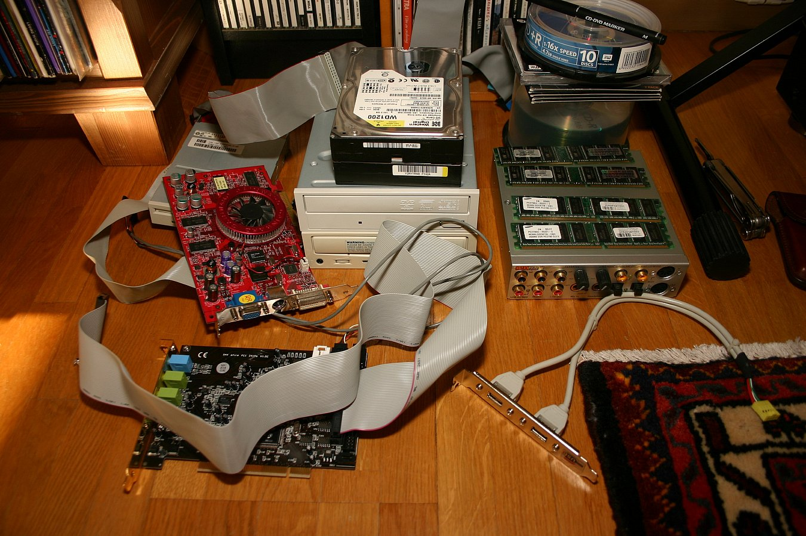
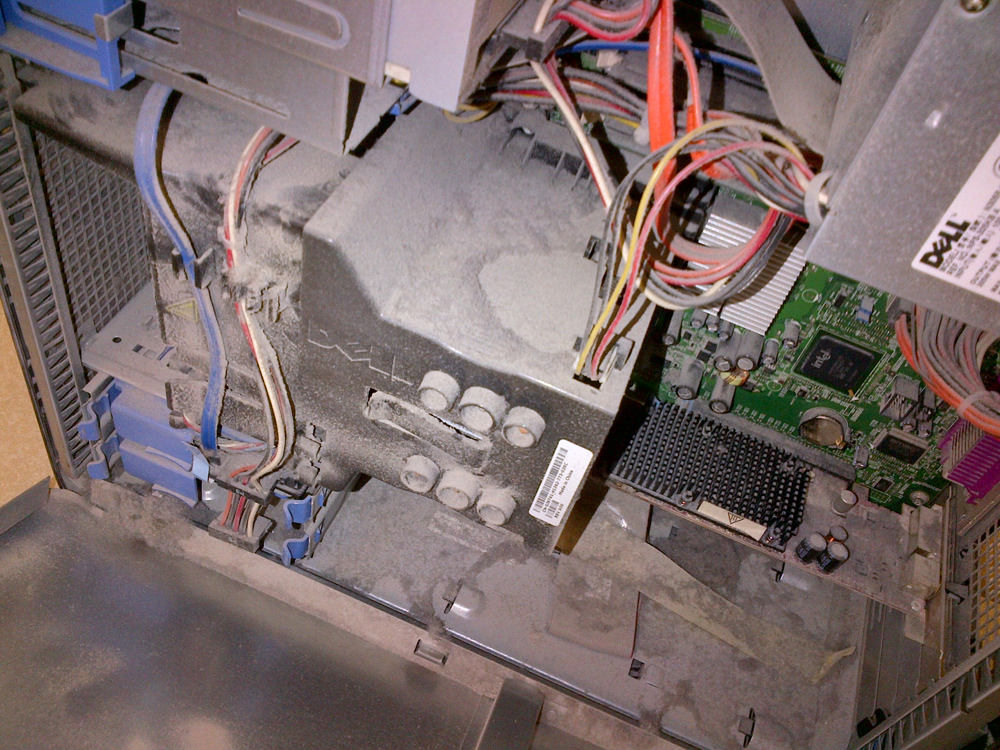
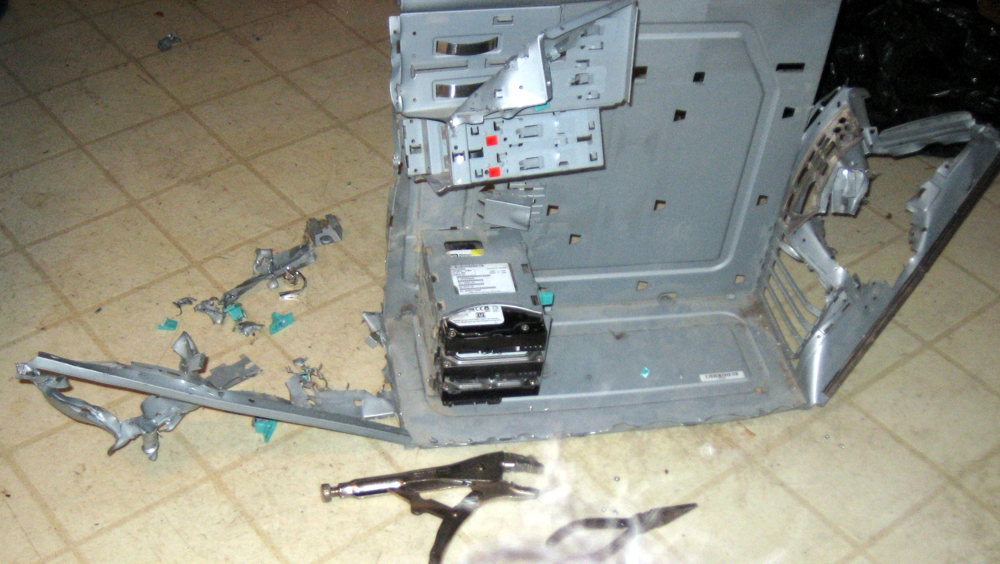
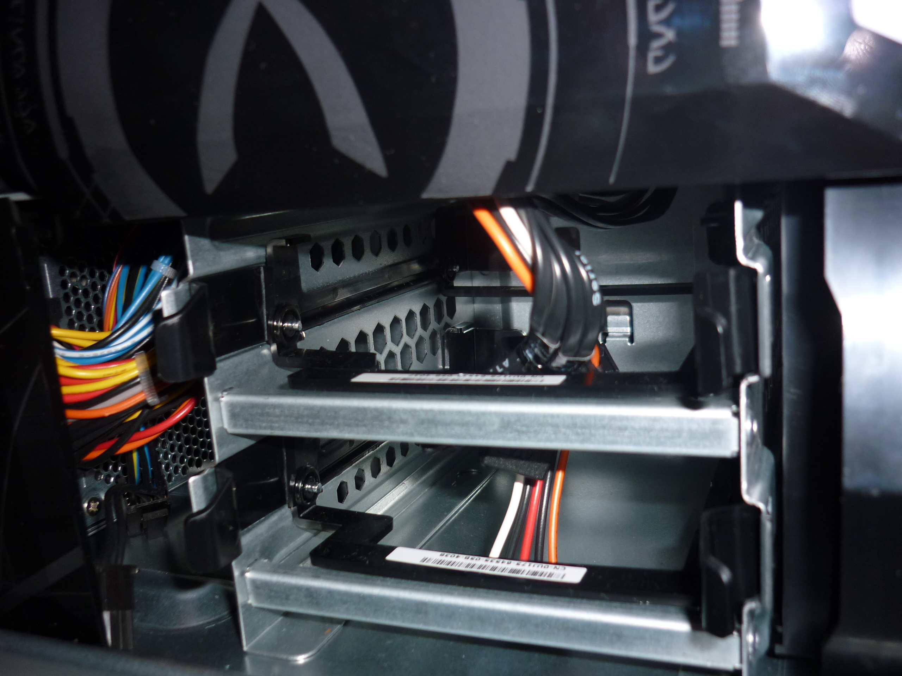
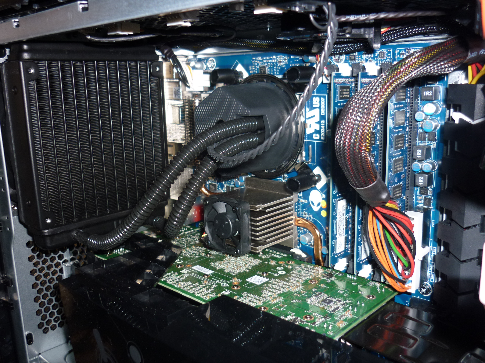
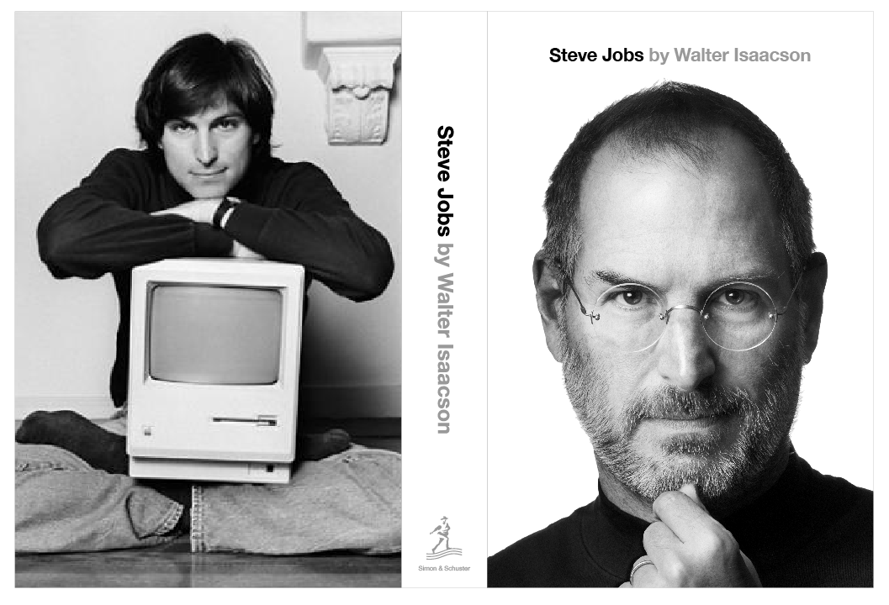
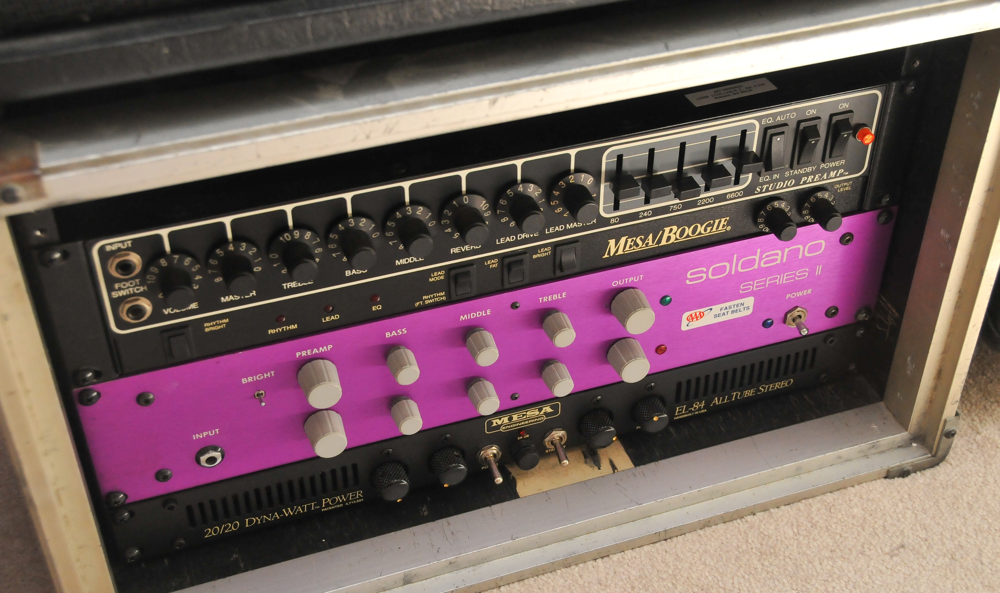

#[fit]Craftsmanship

^ Craftsmanship...

---


^ What do you think of when you hear that word?

---


# Artist

^ Maybe what an artisan or an artist does? Or maybe skill in *any* craft.

---

**crafts·man·ship**
_ˈkraf(t)smənˌSHip/_

noun, plural craftsmen.

1. a person who practices or is highly skilled in a craft; artisan.
2. an artist.

^ If that's what you were thinking, then you're spot on with the definition according to many. If you're like me, you're not great at precise definitions.

---


^ Maybe you've pictured an image in your mind instead. 

---


^ When I think of craftsmanship I envision clean lines

---


^  Attention to detail -- yeah, that's a pumpkin.

---


^ Things created with passion. 

---


#Story

^ I want to tell a friend about the first time that I recall noticing craftsmanship with regards to computers. 

---



^ When I was a teenager I started building computers, I would piece together what I could afford or what my Dad had lying around and I would be proud of what I had built. It was fun and rewarding. 

---

# :frowning: :computer: :wrench: :sweat_smile:

^ I became pretty good at what I was doing, at least others assured me I was, and it wasn't long until people started asking me to help them with their computer problems. 

---

# :man: :boy: :older_man:

^ One time, my Dad came to me and said his friend needed some help with his computer. Now mind you, most of what I had learned about computers was from my Dad so in hindsight ... 

---

#[fit]20/20


^  ... there was no reason that he couldn't help his friend without me. This was probably one of those fatherly lessons that you don't realize occurred until later in life. 

---

#:alien:
##Alienware

^ Anyhow, his friend had just bought a top-tier Alienware computer. This was either late 90s or early 2000's so it was a huge deal, these things were EXPENSIVE. 

---

#:moneybag::moneybag::moneybag::moneybag::moneybag::moneybag:
#:moneybag::moneybag::moneybag::moneybag::moneybag::moneybag:
#:moneybag::moneybag::moneybag::moneybag::moneybag::moneybag:
#:moneybag::moneybag::moneybag::moneybag::moneybag::moneybag:


^ Well, what he needed help with was moving files over from his old system to the new. My dad and I decided that we would pull the hard drive from the old system and put it in the new to perform the transfer. 

^ We cracked open the old computer, I can't remember what it was, probably a Packard Bell or something.

---



^ It was a mess, not just a dusty mess, but the wiring inside looked no better than what I had built myself before. That didn't stand out to me though, that was normal right? We got the drive out and it was time to open the Alienware tower. We were not prepared for what we were about to behold. 

---


^ We didn't even need a screw driver to open it. It had thumb screws on the back, **neat**. No more stripped screws.

---



^ We didn't need to fight to get the case off, and end up with a situation like this. The side panel just slid right off so that you could access the components, **whoa**. 

---




^ And after carefully removing the side panel and revealing the internals I am pretty sure that we both gasped. It was **gorgeous**. At first glance we didn't even see a single cable. 

^ Everything was cleanly routed and zip tied in place. It was very clear that somebody somewhere made a very conscious and deliberate decision that these computers would be built with craftsmanship. 

---

#:moneybag::moneybag::moneybag::moneybag::moneybag::moneybag:
#:moneybag::moneybag::moneybag::moneybag::moneybag::moneybag:
#:moneybag::moneybag::moneybag::moneybag::moneybag::moneybag:
#:moneybag::moneybag::moneybag::moneybag::moneybag::moneybag:

^ This brings me back to the part about this computer being **expensive**. 

^ Things of high craftsmanship intrinsically cost more than those without. To make great things you generally must have great skill and a great amount of time. 

---

#[fit]Inspire

^ Today I am here to inspire you all to (or continue to) practice and exude craftsmanship. 

^ In almost every case, when we start a new project we all aspire to "do things the right way" or "fully unit test" or "... just not *that* again". 

---


^ We have green pastures, the sun is bright and the world is our oyster. 

---


^ Then comes crunch time, it's time to ship, the deadline is approaching, your significant other has told you for the last time it is time to leave and is pulling out of the driveway as you frantically type that last line of code... Whatever it may be, often times we forget about what we set out to do because we let ourselves become rushed and overwhelmed. 

---


^ Then, we let the cows in to our green pastures; they eat the grass and shit everywhere. But who cares? You'll  just clean it up later, right? 

---


^ Right?? Yeah.... probably not. As programmers it is easy for us to let our code get sloppy because the end-user will never see our source code.

---

```
*&*(!^@!@%^&*!@&!*(&@!&*^%@^&*(!@

if user_input {
	do_magic_without_bugs!()
	010111100011100001
} else {
	make_wildest_dreams_come_true()
}

*&*(!^@!@%^&*!@&!*(&@!&*^%@^&*(!@
```

^ As far as they know, the code is a bunch of incoherent symbols and squiggly lines. I would argue that this is the driving factor for the level of apathy I've witnessed when it comes to writing beautiful code. 

---



^ There was a biography that came out about five years ago called Steve Jobs. I am sure most of you are familiar with Steve.

^ He had an unwavering stance on quality and craftsmanship. In the biography he attributes this to his adoptive father. 

---

> He loved doing things right. He even cared about the look of the parts you couldn’t see.
-- Steve Jobs, speaking of his father

^ The parts you couldn't see... Sounds like our jobs right? We are constantly working on the parts that no one sees. The people that built that Alienware computer were working on parts that *most* people would never see. 

---


# FOCUS

^ Do you know what happens when you focus so much energy on the parts that no one sees?

---



#[fit]AMPLIFIED

^ That energy is **amplified** on the parts that they will see. Your pride for the resulting product is also amplified. You will be excited to show people. You will be confident in what you've done. 

---


# TEAM

^ Some of you may be indie and aren't working on a team or haven't inherited a project before. But for most, I suspect that you've walked into someone else's code before.

---

```objectivec
for (NSInteger i = 0; i < 3; i++) {
        switch(i){
        case 0:
                label0.text = title0;
                break;
        case 1:
                label1.text = title1;
                break;
        case 2:
                label2.text = title2;
                break;
        }
}
```

^ How many times do you recall asking yourself "what the...?!" Let's enjoy this one for a bit, a for-switch-loop?!

---


^ Sometimes, your inherited projects won't even run without some voodoo script that you had to discover on your own, or some some tribal knowledge that you had to hunt around the office for.

---


^ How many times have you run across a class with a single method that is 200 lines long and up to 200 columns wide? You know? The ones that look like they were playing Flappy Bird if you turned it on its side.

---


^ The people that wrote those things are by no means dumb, we've all been there. You're quickly prototyping something and you try new things until it works. I don't see anything wrong with that. Where things go wrong is when you don't go back and clean up what you've done. Take what you've created and encapsulate the logic into small easy to read methods or functions. 

---

> Make it run. Make it right. Make it fast.
-- Ken Auer

^ I like this quote by Ken Auer, that describes the three phases you should take when crafting software: 

---

# Make it run.

^ Make it run is the stage where you're trying things out. You're not quite sure if it will work so you've got variations of things commented out and all jammed into one big method. 

---

# Make it right.

^ Make it right is where you take all of what you learned and wrap it up into simple routines that can be tested and easily read by "future you". Whether "future you" may actually be you or your replacement. 

---

# Make it fast.

^ Make it fast is when you start to worry about performance. Now that all of your routines are neatly packed away, you can pinpoint the slow parts of the code using instruments, like a true craftsman, and safely make isolated modifications to increase performance. 

^ Often times we stop after "Make it run.", it's time to stop, stopping.

---

# [fit]Limits
# Expectations
# [fit] Awareness

^ Now, you may complain "there's no way I have time to make it right and make it fast with these crazy deadlines given to me by my boss!" Or you might say "if I spend tons of extra time, it will take forever to complete my app - and time is money!"

^ I get it, I've been there, we all have. Craftsmanship is not just about creating great things. It is about knowing your craft and its limits so that you clearly understand what can and cannot be done. 

^ Setting expectations with yourself, your peers, your boss and your customer or client is a part of the craft. No one is going to be happy when something goes out the door half-baked and falling on its face. 

^ Be clear with everyone involved what can and cannot be achieved. If anything changes during the project, make everyone aware as soon as possible. 

---


^ Let's take a moment to step outside the world of computer programming and look at what is happening in the retail consumer space. This may be dependent on where you're from, but in the past few years I've noticed a trend. People are starting to appreciate hand crafted or hand picked goods. 

---


^ Craft beer brewing has exploded, the mass producing beer companies are being hit hard as consumers prefer hand crafted local brews. 

---


^ Alternate coffee brewing methods are becoming popular along with specialty coffee beans. People are looking past the big pre-ground canisters at the grocery store and are looking to local roasters who've sourced and freshly roasted unique beans. 

---

#[fit]Etsy.com
#$1 Billion in 2013

^ Etsy.com, a website for handmade and vintage goods reported over one-billion dollars in sales for 2013. People are flocking to uniquely hand-crafted merchandise and are staying away from big box stores. 

^ The goods on Etsy are nowhere near as competitive in price to the big box stores. 

---

#[fit] Coffee
#$2x - $10x

^ The speciality coffee beans typically cost twice as much and are in some instances upwards of 10 times as much as mass produced beans. 

---

#[fit] Beer 
#$2x - $4x

^ The craft beers are typically 2-4 times as expensive as their mass produced competitors. 

^ People appreciate craftsmanship. People pay a premium for craftsmanship. 

--- 

# [fit] Imagine
#GitHub.com
# [fit] Fully Documented

^ Now consider every library on GitHub that has reached it's self proclaimed version 1.0. Imagine a world where all of those libraries are fully unit tested. A world where 90% of their methods are less than 15 lines of code, every public API it has is well documented, and it has a clear "Getting Started" README and tutorial.

---

# [fit] Imagine
## StackOverflow.com
#[fit] High Quality

^ Imagine a world where the difficult questions on Stack Overflow are actually answered rather than the simple ones being cherry picked by point seekers. 

---

```
$ git clone [project]
$ cd project
$ sh build.sh
$ sh run.sh
```

^ Imagine a world where you start work at a new company and you can checkout the source code of the project you'll be working on and build it with the press of a single button or typing one command. 

---


^ Imagine a world where every developer on the team respects the style guide and consciously follows it.

^ Imagine a world where craftsman programmers are the norm, appreciated, and paid well by their employers. 

^ This is good world, I like this world and I think you will too. 

---


^ Well crafted things are often considered a luxury, and I'll agree with that. What I won't agree with however is that shoddy software is acceptable. Prototypes... fine I won't argue there. Proving a point? Again that's fine, hack away. But when you are shipping products that people depend on, give them your best. 

^ You may be working on some products that have short lifespan or a small audience and it may seem okay to cut corners. But realize that anytime you do anything, you're building up tolerance and creating habits. You've cut that corner 5 times before and nothing went wrong, so why not continue doing so?

---


^ How would you feel if a civil engineer who designed a bridge you drive your family across thought like that? Or an aerospace engineer who designed a commercial airliner that your parents travel in to visit you for the holidays? 

^ Engineering is a huge responsibility. Society depends on engineers to do the right thing and to do it well. As software engineers we may not be building applications that can directly harm someone right now or ever. But we are always influencing our peers who may some day work on such projects. 

---


^ As we move further into the future, software is arguably becoming the crux of how our world operates. Robotics are beginning to replace jobs previously held by humans and will continue to do so at increasing rates. Cars are starting to drive themselves. Engineers of all disciplines are using software to design buildings, bridges, vehicles, etc... There are so many lives that will and already do depend on well crafted software. 

---


^ Software architects are building the pillars for which society will stand on, and you're a part of that. 

---


^ So from now on, when you think of writing code, I hope that you think of it in terms of craftsmanship. Whether you're heading down the road of starting a new project or working on an existing one, take pride in what you are doing. Don't skimp on the parts you expect no one will ever see. You never know who will crack open that Alienware box of your code and walk away inspired. 
